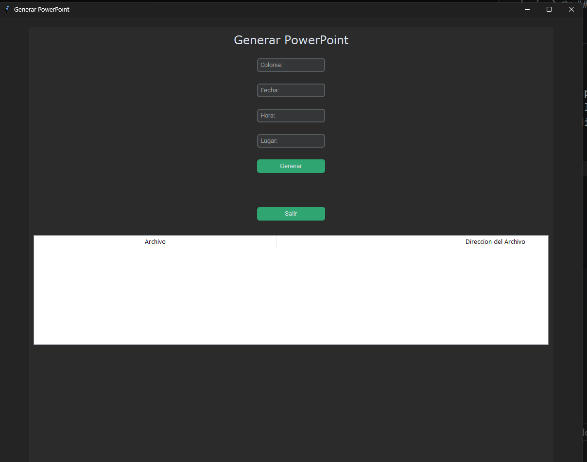

# Generador de archivos pptx para agilizar tareas
Pequeño proyecto que acabo de hacer, noté que donde hago mi servicio social hay pocos empleados y los que hay son adultos mayores, asi que hice este programa para resolver ese problema.
Soy nuevo haciendo readmes detallados, asi que si no se entiende sorry 🐈

## Tecnologías
libreria python-pptx
pip install python-pptx
customtkinter
JSON (datos)

### Guia
Cuando inicies el programa solo debes teclear los valores que corresponden al formato, 
Luego das click a Generar y escribes el nombre de tu archivo pptx y lugar donde guardarlo, sencillo.
la tabla de abajo dice los archivos que has generado, y tambien la dirección de dicho archivo.

